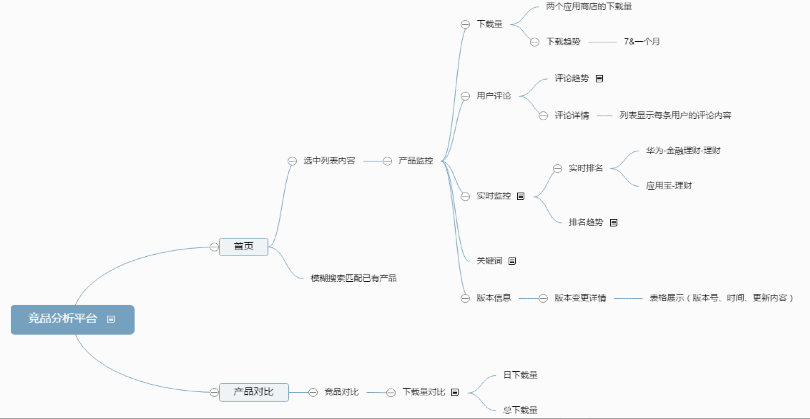
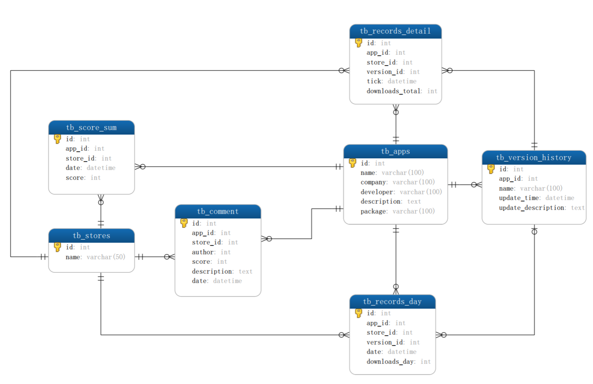

# 1 引言

1.1 需求背景

互联网消费金融领域竞争越来越激烈，如何在消费金融领域中做到前列，就需要深入分析竞争对手的产品优势与不足，总结经验，从而把公司产品做的更好，因此需要建立一个竞品分析平台。帮助相关人员更好的分析竞品，简化竞品分析流程，从而更好的进行产品分析设计。

1.2 产品概述

本产品主要是分析下竞品安卓端的app情况，包括收集竞品app在各大应用商店的相关信息，进行后续加工处理，帮助产品经理便于更好的分析竞品。

1.3阅读范围

开发设计等相关人员

1.4名词说明

竞品：竞争对手的相关产品。

# 2 需求概要

## 2.1 产品架构流程图

1）平台业务流程

如图所示本产品主要分为两大模块，“首页”模块中主要展示app的相关信息，“产品对比”模块中主要展示同类竞品的对比情况。

2）数据收集流程

通过爬虫收集各大应用商店竞品app的数据，存入数据库，供平台调用。

## 2.2 运行环境
  
python3.6 + scrapy1.4 + mysql5.17

# 3 功能需求

## 3.1 爬虫模块

## 3.2 数据库模块

## 3.3 竞品平台模块

